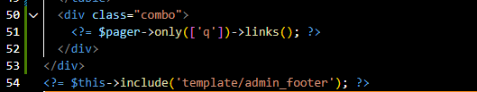
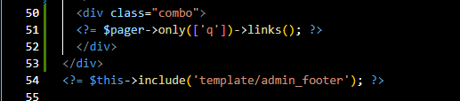

| Nama          |     Sardin     |
|-------------- | ---------------|
| NIM           | 312010298      |
| Kelas         | TI.20.A2       |
| Matkul        | Pemograman web |

# Pratikum 14 

### Langkah-langkah Praktikum

### Membuat Pagination

Pagination merupakan proses yang digunakan untuk membatasi tampilan yang panjang
dari data yang banyak pada sebuah website. Fungsi pagination adalah memecah
tampilan menjadi beberapa halaman tergantung banyaknya data yang akan ditampilkan
pada setiap halaman.

Pada Codeigniter 4, fungsi pagination sudah tersedia pada Library sehingga cukup
mudah menggunakannya.

Untuk membuat pagination, buka Kembali Controller Artikel, kemudian modifikasi
kode pada method admin_index seperti berikut.

Kemudian buka file views/artikel/admin_index.php dan tambahkan kode berikut
dibawah deklarasi tabel data.

        <?= $pager->links(); ?>

Selanjutnya buka kembali menu daftar artikel, tambahkan data lagi untuk melihat
hasilnya.

### Membuat Pencarian

Pencarian data digunakan untuk memfilter data.

Untuk membuat pencarian data, buka kembali Controller Artikel, pada method
admin_index ubah kodenya seperti berikut :

Kemudian buka kembali file views/artikel/admin_index.php dan tambahkan form
pencarian sebelum deklarasi tabel seperti berikut:

Dan pada link pager ubah seperti berikut.

        <?= $pager->only(['q'])->links(); ?>
    

Selanjutnya ujicoba dengan membuka kembali halaman admin artikel, masukkan kata kunci tertentu pada form pencarian. Akses http://localhost:8080/index.php/admin/artikel

### Upload Gambar
Menambahkan fungsi unggah gambar pada tambah artikel. Buka kembali Controller
Artikel, sesuaikan kode pada method add seperti berikut:

Kemudian pada file views/artikel/form_add.php tambahkan field input file seperti
berikut.

Dan sesuaikan tag form dengan menambahkan ecrypt type seperti berikut.

Ujicoba file upload dengan mengakses menu tambah artikel. Akses http://localhost:8080/index.php/admin/artikel/add

